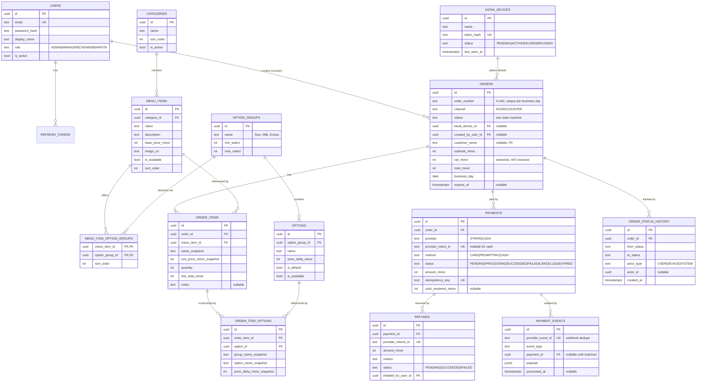
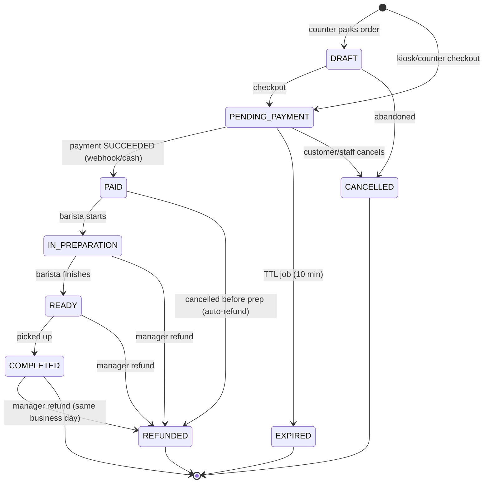
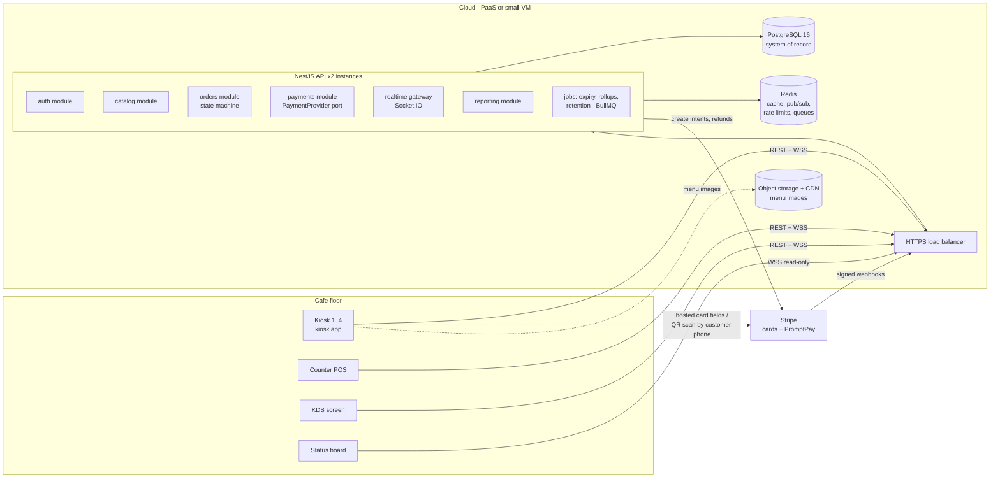

# CafePOS — Backend Design for a Cafe POS System with Full Kiosk Support

| | |
|---|---|
| **Author** | La Yaung Phyo |
| **Date** | 2026-06-11 |
| **Status** | In active development — building per the §17 roadmap |
| **Stack** | NestJS 11 · TypeScript · PostgreSQL 16 · Drizzle ORM · Redis · Stripe |
| **Scope** | Single cafe location: self-order kiosks, counter POS, Kitchen Display System, reporting |

---

## Table of Contents

1. [Executive Summary](#1-executive-summary)
2. [Project Overview, Target Users, Core Problem](#2-project-overview-target-users-core-problem)
3. [Requirement Analysis](#3-requirement-analysis)
4. [Domain Model](#4-domain-model)
5. [API Specification](#5-api-specification)
6. [Authentication & Authorization](#6-authentication--authorization)
7. [Database Design](#7-database-design)
8. [Validation Rules](#8-validation-rules)
9. [Error Handling](#9-error-handling)
10. [Security Review](#10-security-review)
11. [Scalability Analysis](#11-scalability-analysis)
12. [System Architecture](#12-system-architecture)
13. [Monitoring & Observability](#13-monitoring--observability)
14. [Testing Strategy](#14-testing-strategy)
15. [Future Enhancements](#15-future-enhancements)
16. [Production Readiness Checklist](#16-production-readiness-checklist)
17. [Development Roadmap](#17-development-roadmap)

---

## 1. Executive Summary

CafePOS is the backend for a single-location cafe point-of-sale system in which **self-order kiosks are first-class clients**, not an afterthought. Customers order and pay at unattended kiosks; staff manage the same order pipeline from a counter POS; baristas work from a real-time Kitchen Display System (KDS); the owner gets sales reporting and end-of-day reconciliation.

The design optimizes for three things, in order:

1. **Money correctness** — orders, payments, and refunds must never disagree with the payment gateway, even across crashes, retries, and duplicate webhooks.
2. **Operational simplicity** — one small team (or one student) must be able to run this. Every component must justify its existence.
3. **A defensible growth path** — single-cafe scale is trivial; the document is explicit about what breaks first if the system grows, rather than pretending the cafe is Netflix.

### Key decisions at a glance

| Area | Decision | Rejected alternatives (and why) |
|---|---|---|
| Architecture | **Modular monolith** (NestJS modules) | Microservices — operational cost is absurd at 1 location; serverless — websockets + webhooks get awkward |
| Database | **PostgreSQL + Drizzle ORM** | SQLite — no concurrent-writer safety across instances, weak online backup story; MongoDB — orders/payments are relational and transactional by nature |
| Staff auth | **JWT access (15 min) + rotating refresh tokens** | Server sessions — fine too, but JWT keeps the KDS/kiosk story uniform; tradeoff discussed in §6 |
| Kiosk auth | **Device identity**: pairing-code activation → scoped, revocable device token | Shared staff account on kiosks — unauditable and unrevocable per device |
| Payments | **Gateway-hosted payment (Stripe: card + PromptPay QR)**; webhook is the source of truth; idempotency keys everywhere | Self-handled card data — pulls the system into full PCI-DSS scope, a non-starter |
| Money | **Integer minor units (satang)**, single currency | Floats — rounding bugs; `DECIMAL` — workable, but integers are unambiguous in every language layer |
| KDS realtime | **WebSockets** (NestJS gateway) + Redis pub/sub | Polling — wasteful but acceptable fallback; SSE — fine for KDS but kiosks also need server push for payment confirmation |
| Reporting | **SQL aggregates now, nightly rollup table for history** | OLAP/warehouse — premature at thousands of orders/month |

### What this design deliberately excludes (v1)

Inventory/ingredient tracking, loyalty/membership, promotions engine, multi-branch, multi-tenancy, and offline-first kiosks are **out of scope for v1** and treated in §15 (Future Enhancements). Each exclusion is a scoping decision, not an oversight — see §3.3 for the requirements they would introduce.

---

## 2. Project Overview, Target Users, Core Problem

### 2.1 Project overview

A busy cafe serves coffee, drinks, and pastries. Today, every order funnels through one or two cashiers: the cashier takes the order, customizes it ("iced, oat milk, extra shot, less sweet"), takes payment, and relays it to the bar. At peak hours the cashier is the bottleneck, the queue spills out the door, and order mistakes happen in the verbal relay.

CafePOS replaces that funnel with a system of four client surfaces backed by one API:

- **Self-order kiosks** (tablets in stands): customers browse the menu with photos, customize drinks through structured options, pay by card or PromptPay QR at the kiosk, and receive a queue number. "Full kiosk" means the entire order-to-payment flow completes with zero staff involvement.
- **Counter POS** (cashier tablet/terminal): the same ordering capability for customers who prefer a human, plus cash handling, order lookup, cancellations, and refund initiation.
- **Kitchen Display System** (screen at the bar): live queue of paid orders with their customizations; baristas advance orders through preparation states; a customer-facing status board shows "preparing / ready" queue numbers.
- **Back office** (manager/owner web app): menu and price management, device management, staff accounts, sales reports, end-of-day reconciliation.

The backend is a single NestJS API serving REST over HTTPS plus a WebSocket channel for real-time order events, with PostgreSQL as the system of record and Stripe as the payment processor.

### 2.2 Target users

| Actor | Surface | What they do | Technical reality |
|---|---|---|---|
| **Customer** | Kiosk (anonymous) | Browse menu, customize, pay, watch status board | Never authenticates; the *kiosk device* is the authenticated party |
| **Cashier** | Counter POS | Create orders, take cash, look up orders, cancel pre-payment orders | Staff account, lowest staff privilege |
| **Barista** | KDS | See paid orders, start/finish preparation, mark ready/picked-up, 86 items (mark sold out) | Staff account, kitchen-scoped privilege |
| **Manager** | Back office + POS | Everything above + menu/price edits, refunds, reports, device pairing | Elevated staff account |
| **Owner/Admin** | Back office | Everything + staff account management, settings | Root-level account |
| **Kiosk device** | — | Machine actor: reads menu, creates orders, initiates payments for its own orders | Holds a scoped device token; treated as a distinct principal in authorization |

### 2.3 Core problem

**The cashier is a serialization point.** Every customer, regardless of how simple their order is, consumes cashier time for order entry *and* payment. Kiosks parallelize order intake (4 kiosks ≈ 4 extra cashiers at peak) and remove transcription errors, but only if the backend treats unattended operation seriously: payments must be safe without a human watching, abandoned orders must clean themselves up, and a kiosk must never be a credential that unlocks the rest of the system if stolen.

Secondary problems solved: verbal order relay → structured KDS tickets; end-of-day cash-vs-gateway reconciliation done by hand → Z-report endpoint; "are we out of oat milk?" → availability flags propagated to kiosks in seconds.

---

## 3. Requirement Analysis

### 3.1 Functional requirements

**Catalog**

- **FR-1** Staff (manager+) can CRUD categories and menu items (name, description, photo, base price, sort order).
- **FR-2** Menu items have **option groups** (e.g. Size, Milk, Extras) with per-option price deltas; groups define min/max selections (Size: exactly 1; Extras: 0–5).
- **FR-3** Any staff member can toggle item or option availability ("86 oat milk"); kiosks reflect this within 10 seconds.
- **FR-4** Kiosks fetch the full menu in one request, cacheable and versioned (ETag), so 4 kiosks refreshing doesn't hammer the DB.

**Ordering**

- **FR-5** Kiosks create orders with line items, option selections, quantities, and free-text notes per item, plus an optional customer name for call-out.
- **FR-6** The server — never the client — computes all prices from the catalog at order time and snapshots names/prices onto the order (a later price change must not alter an existing receipt).
- **FR-7** Counter POS supports the same order creation plus **cash tender** (records amount tendered / change) and **parked (draft) orders**.
- **FR-8** Orders follow an explicit state machine (§4.4); invalid transitions are rejected with a machine-readable error.
- **FR-9** Each order gets a short human-friendly daily queue number (`A-042`) distinct from its UUID.
- **FR-10** Orders pending payment expire automatically (default 10 min) and release their queue number slot.

**Payments**

- **FR-11** Kiosk payments: card (gateway-hosted entry) and PromptPay QR via Stripe PaymentIntents. The backend never sees card numbers.
- **FR-12** Payment confirmation is driven by **webhooks**, not by the kiosk's claim of success; the kiosk is notified of confirmation over its WebSocket channel.
- **FR-13** Order and payment creation accept **idempotency keys** so kiosk retries (flaky wifi, app crash) never double-charge or double-order.
- **FR-14** Managers can issue full or partial refunds; refunds are tracked as first-class records linked to the original payment.
- **FR-15** Every webhook event received is stored (deduplicated by provider event id) for audit and replay.

**Kitchen Display System**

- **FR-16** KDS shows all active orders (paid → ready) in real time with full customization details; baristas transition orders (start prep, ready, picked up).
- **FR-17** A customer-facing status board lists queue numbers in "Preparing" and "Ready" — no other order data (no names, no items).
- **FR-18** Status changes propagate to all connected screens in under 2 seconds.

**Reporting**

- **FR-19** Sales reports: revenue, order count, average ticket — filterable by date range, grouped by day or hour; top-selling items.
- **FR-20** **Z-report** (end-of-day): per payment method totals, refunds, cancelled/expired counts, gateway-vs-DB reconciliation delta for a given business day.

**Administration**

- **FR-21** Admin manages staff accounts (create, deactivate, role assignment); manager pairs/renames/revokes kiosk devices.
- **FR-22** Every order state change records who/what caused it (user, device, or system job) in an immutable history.

### 3.2 Non-functional requirements (measurable, not vibes)

| NFR | Target | Rationale |
|---|---|---|
| **Performance** | p95 < 300 ms for all REST endpoints; menu read p95 < 100 ms (cached) | Kiosk UX: customers abandon slow kiosks |
| **Realtime latency** | Order events on KDS/status board < 2 s end-to-end | Baristas work from it live |
| **Availability** | 99.5% during business hours (07:00–20:00) ≈ ≤ 2 min downtime/day | A down backend = kiosks dead = cafe degraded to cash-only counter |
| **Payment correctness** | Zero tolerance: no order marked PAID without a gateway-confirmed payment; no double charge from retries | This is the property the design is built around |
| **Scalability** | Comfortable at 10× assumed peak (≈ 30 orders/min) with no redesign | §11 shows the math |
| **Security** | Kiosk compromise must not expose staff functions or other orders; PCI scope = SAQ-A (gateway-hosted card entry) | Kiosks are physically accessible to the public |
| **Reliability** | Crash-safe money flows: any process may die between any two steps and the system reconciles via webhooks/jobs | |
| **Data durability** | RPO ≤ 5 min (WAL archiving / managed PITR), RTO ≤ 1 h | Losing a day of orders = losing the day's accounting |
| **Cost** | Runs on ~$20–40/month (1 small VM or PaaS + managed Postgres + Stripe fees) | Single cafe economics |
| **Auditability** | Order status history and payment events immutable for ≥ 5 years (Thai tax retention) | §7.5 retention |

### 3.3 Missing requirements the template didn't ask about (but production would)

Being critical, as requested — these are holes in the original problem statement:

1. **Offline behavior is undefined.** "Full kiosk" implies the kiosk works… until the internet doesn't. **Decision for v1:** kiosks hard-require connectivity; on backend unreachability they display "Please order at the counter." Offline-first ordering (local queue + sync) is a v3-level project with hairy payment implications (§15). The counter POS with cash remains the degraded mode.
2. **Receipt printing.** Customers may want receipts; Thai businesses may need to issue tax invoices on request. v1: e-receipt rendered by kiosk from order data + a printed queue-number slip via kiosk-local printer (kiosk's job, not the backend's — backend just serves order JSON). Full tax-invoice generation is out of scope and flagged to stakeholders.
3. **Tax model.** Assumed: **VAT-inclusive pricing at 7%** (Thai convention — the menu price is what the customer pays; VAT is extracted for reporting, `vat = total × 7/107`). A US-style add-on tax changes the pricing pipeline and rounding rules; this must be confirmed before any code is written.
4. **Refund policy.** Who may refund (manager), within what window (same business day for v1), to original payment method only. Cash refunds for QR payments are explicitly disallowed in v1 (reconciliation nightmare).
5. **PDPA (Thai data protection).** The only customer PII is an optional first name for call-out. Decision: keep it that way in v1; names purged after 90 days (§7.5). Loyalty (v2) is what triggers real PDPA work.
6. **Order throttling under kitchen overload.** What happens when 40 orders are queued and prep time exceeds 25 min? v1: KDS shows queue depth; manager can pause kiosk ordering (device-level `ORDERING_PAUSED` flag). Auto-throttling by estimated wait is v2.
7. **Multi-currency / tipping.** Out: single currency (THB). Tipping is uncommon at Thai kiosks; excluded.

### 3.4 Edge cases the design must survive

| # | Edge case | Where handled |
|---|---|---|
| E1 | Customer pays, kiosk crashes before showing confirmation | Webhook still arrives → order becomes PAID → appears on KDS; queue slip recoverable at counter by name/last-4 (§5.4, §12.3) |
| E2 | Webhook arrives before the kiosk's own confirm call returns | Both paths converge on payment state; transitions are idempotent (§4.4) |
| E3 | Customer abandons mid-payment (walks away from QR screen) | Payment intent + order expire via TTL job; gateway intent cancelled (§4.4, FR-10) |
| E4 | Duplicate webhook delivery (Stripe retries) | `payment_events.provider_event_id` unique constraint → dedupe (§7) |
| E5 | Kiosk retries `POST /orders` after timeout | Idempotency key returns the original order, not a duplicate (§5.7) |
| E6 | Item is 86'd between kiosk menu load and order submit | Server validates availability at order time → `409 ORDER_ITEM_UNAVAILABLE` with offending items listed; kiosk prompts customer to adjust (§8) |
| E7 | Price changes between menu load and order submit | Server prices from current catalog; if total differs from the kiosk's displayed total (sent as `expectedTotal`), reject with `409 PRICE_MISMATCH` rather than silently charging a different amount |
| E8 | Two baristas grab the same order simultaneously | Optimistic state transition: `UPDATE … WHERE status = expected` → loser gets `409 ORDER_INVALID_TRANSITION` (§4.4) |
| E9 | Refund issued for an order already refunded | Refundable amount tracked; over-refund rejected (§8) |
| E10 | Clock boundary: order placed at 23:59, business day rollover | Queue numbers and Z-reports keyed to a configurable **business day** (e.g. 05:00–05:00), not calendar UTC days |
| E11 | Stolen kiosk tablet | Device token revocation (single click in back office); token grants only menu-read + own-order scope anyway (§6.3, §10) |
| E12 | Cash drawer doesn't match Z-report | Z-report separates cash-expected vs gateway-confirmed; cash variance is a human problem the report makes visible, not solvable in software |

### 3.5 Assumptions (stated so they can be challenged)

- One physical location, one menu, one currency (THB), one VAT rate, prices VAT-inclusive.
- Peak load: ~6 orders/minute (4 kiosks + 2 counter, one order each ~every 40–60 s). Daily volume ≈ 400–800 orders.
- Kiosks are managed tablets in locked stands running a dedicated kiosk app (browser kiosk mode or wrapped webview) on cafe wifi/LTE.
- Stripe is available for the merchant (supports THB cards + PromptPay). If only a local Thai PSP is available (Omise/2C2P/GBPrimePay), the `PaymentProvider` port (§12.4) absorbs the difference — the same intent/webhook shape applies.
- Staff count ≤ 20; menu ≤ 200 items; these never need pagination-at-scale treatment, and the design says so honestly rather than cargo-culting.

### 3.6 Suggested improvements over the implicit ask

- The original ask ("a cafe POS that supports full kiosk") treats kiosk as a feature. This design inverts it: **kiosk-first API**, counter POS as a privileged client of the same endpoints. One order pipeline, not two.
- Add `expectedTotal` to order submission (E7) — cheap to implement, eliminates an entire class of customer-trust incidents.
- Make the **status board public and PII-free** (FR-17) instead of reusing the KDS view — separating them costs one endpoint and removes any temptation to put a staff screen where customers can see it.

---

## 4. Domain Model

### 4.1 Entities and relationships



### 4.2 Why the model looks like this

- **Option groups are shared, not embedded.** "Milk" (regular/oat/none) applies to 40 drinks. A join table (`MENU_ITEM_OPTION_GROUPS`) lets a manager edit the Milk group once. The alternative — copying groups per item — is simpler to query but turns "oat milk price +15฿" into a 40-row update with drift risk.
- **Snapshots on order lines.** `ORDER_ITEMS` and `ORDER_ITEM_OPTIONS` copy the name and price at purchase time. Receipts and reports must reflect what the customer actually paid; foreign keys to live catalog rows are kept only for analytics ("top sellers"), never re-read for money.
- **Payments are separate from orders, plural.** An order can have a failed card attempt followed by a successful PromptPay attempt. Modeling payment as columns on `orders` (a common shortcut) cannot represent that, and makes reconciliation against the gateway's records impossible.
- **`PAYMENT_EVENTS` is an append-only inbox.** Every webhook is stored before processing. This buys: dedupe (unique provider event id), audit ("what did Stripe actually tell us at 14:02?"), and replay after a processing bug — for one table.

### 4.3 Aggregates and consistency boundaries

Treating this with DDD vocabulary (lightly — this is a monolith, not a seminar):

| Aggregate root | Members | Invariant enforced inside one transaction |
|---|---|---|
| **Order** | order_items, order_item_options, status history entry | `total = Σ line totals`; status transitions valid; items reference available catalog entries at creation |
| **Payment** | refunds, matched payment_events | `Σ refunds ≤ payment amount`; status moves only forward (no SUCCEEDED → PENDING) |
| **MenuItem** | its option-group attachments | min/max select sanity (`0 ≤ min ≤ max`) |
| **KioskDevice** | — | token lifecycle (PENDING → ACTIVE → REVOKED is one-way) |

Order and Payment are deliberately **separate aggregates** linked by id: a webhook updates a Payment and then *requests* an Order transition (PENDING_PAYMENT → PAID) in the same DB transaction, but the order state machine still validates it. This is what makes E2 (webhook/confirm race) safe — both paths funnel through one guarded transition.

### 4.4 Order state machine



Rules that the diagram can't show:

- **`DRAFT` exists only for the counter** ("park this order while the customer decides"). Kiosk carts live client-side; creating server-side drafts for every browsing customer would litter the DB with garbage rows and queue numbers.
- **Every transition is guarded and atomic**: `UPDATE orders SET status = :to WHERE id = :id AND status = :from`. Zero rows updated → `409 ORDER_INVALID_TRANSITION`. This single pattern resolves E2 (webhook race) and E8 (two baristas) without locks.
- **`PAID` is reachable only from a payment-side fact** — a `payments` row entering `SUCCEEDED` (gateway webhook, or cash tender by staff). No endpoint sets an order to PAID directly.
- **Every transition writes `ORDER_STATUS_HISTORY`** with the actor (FR-22). The history is the audit trail; `orders.status` is just the current pointer.
- **Partial refunds don't change order status.** `REFUNDED` means fully refunded; a partial refund (wrong size on one of four drinks) leaves the order in its current state with refund records attached. The Z-report sums refunds independently of order status.

### 4.5 Business rules summary

| # | Rule |
|---|---|
| B1 | Server recomputes all money from the catalog; client totals are advisory (`expectedTotal` check, E7) |
| B2 | Option selections must satisfy each attached group's min/max; unavailable options are rejected |
| B3 | An order's queue number is assigned at checkout (not draft), unique per business day, recycled never (date+counter) |
| B4 | Only one non-terminal payment may exist per order at a time (no two live intents racing) |
| B5 | Refund total per payment ≤ captured amount; refunds require MANAGER+ |
| B6 | Cash payments are allowed only via counter POS (CASHIER+), never from a kiosk device token |
| B7 | Business day boundary is configurable (default 05:00 local) and stamps `orders.business_day` at creation |
| B8 | 86'd items remain in the catalog (soft availability flag) so history and reports keep working |

---

## 5. API Specification

### 5.1 Conventions

- Base path **`/api/v1`** (URI versioning — simplest to operate and debug; header versioning rejected as invisible in logs and curl).
- JSON everywhere; `Content-Type: application/json` except the webhook endpoint (raw body needed for signature verification) and image upload (multipart).
- Authentication: `Authorization: Bearer <token>` — staff JWT or kiosk device token (§6). The webhook endpoint authenticates by signature instead.
- Money: integer minor units + currency code, e.g. `"totalMinor": 12000, "currency": "THB"` (= ฿120.00).
- Timestamps: ISO-8601 UTC. IDs: UUIDv7 (time-ordered → friendly to B-tree indexes and cursor pagination).
- Mutating requests that money depends on (`POST /orders`, `POST /orders/:id/payments`) accept an **`Idempotency-Key`** header (§5.7).
- Soft deletes for catalog entities (availability/active flags); hard `DELETE` only where history can't reference the row.

**Pagination.** Two honest regimes instead of one cargo-culted one:

- **Catalog lists** (≤ 200 rows): no pagination. Returning a whole menu is correct; paginating 60 items would be theater.
- **Order lists** (unbounded growth): **cursor pagination** — `?limit=25&cursor=<opaque>` → response carries `"nextCursor"`. Cursor = encoded `(created_at, id)` of the last row. Offset pagination rejected for orders: `OFFSET 50000` degrades linearly and skips/duplicates rows when new orders arrive mid-scroll.

**Filtering / sorting / search** (order list is the showcase):

```
GET /api/v1/orders?status=PAID,IN_PREPARATION&channel=KIOSK
                  &from=2026-06-11T00:00:00Z&to=2026-06-12T00:00:00Z
                  &q=A-042&sort=-createdAt&limit=25&cursor=...
```

- `status`, `channel`, `method` — comma-separated enums (validated against the enum, unknown values → 422).
- `from`/`to` — ISO range on `created_at`; `businessDay=2026-06-11` as the reporting-friendly alternative.
- `q` — matches order number exactly or customer name prefix (ILIKE). Full-text search is not warranted for order lookup.
- `sort` — whitelist: `createdAt`, `totalMinor`, prefix `-` for desc. Default `-createdAt`. Arbitrary column sorting rejected (injection surface + unindexed sorts).

### 5.2 Endpoint catalog

Roles column: A=ADMIN, M=MANAGER, C=CASHIER, B=BARISTA, K=KIOSK device. §6.4 has the full matrix.

**Auth & staff**

| Method & path | Purpose | Roles | Success | Notable errors |
|---|---|---|---|---|
| `POST /auth/login` | Staff login → access + refresh tokens | public | 200 | 401 `AUTH_INVALID_CREDENTIALS`, 429 |
| `POST /auth/refresh` | Rotate refresh token → new pair | public (refresh token in body) | 200 | 401 `AUTH_REFRESH_REUSED` (reuse detection) |
| `POST /auth/logout` | Revoke refresh-token family | any staff | 204 | — |
| `GET /auth/me` | Current principal + role | any staff, K | 200 | — |
| `POST /users` | Create staff account | A | 201 | 409 `USER_EMAIL_EXISTS` |
| `GET /users` | List staff | A, M | 200 | — |
| `PATCH /users/:id` | Update role / deactivate | A | 200 | 422 `USER_LAST_ADMIN` (can't demote/deactivate last admin) |

**Kiosk devices**

| Method & path | Purpose | Roles | Success | Notable errors |
|---|---|---|---|---|
| `POST /devices` | Create device + one-time 8-char pairing code (10-min TTL) | A, M | 201 | — |
| `POST /devices/activate` | Kiosk exchanges pairing code → long-lived device token (shown once) | public (code-gated) | 200 | 401 `DEVICE_PAIRING_INVALID`, 410 expired |
| `GET /devices` | List devices + last-seen + status | A, M | 200 | — |
| `PATCH /devices/:id` | Rename / pause ordering (`status: PAUSED`) | A, M | 200 | — |
| `POST /devices/:id/revoke` | Kill token immediately (stolen tablet) | A, M | 204 | — |

**Catalog**

| Method & path | Purpose | Roles | Success | Notable errors |
|---|---|---|---|---|
| `GET /menu` | Composite menu (categories→items→groups→options), `ETag` + `Cache-Control` | K, all staff | 200 / 304 | — |
| `POST /categories` · `PATCH /categories/:id` | Manage categories | A, M | 201 / 200 | 409 `CATEGORY_NAME_EXISTS` |
| `POST /items` · `PATCH /items/:id` | Manage items (price, name, photo, category) | A, M | 201 / 200 | 422 validation |
| `PATCH /items/:id/availability` | 86 / un-86 an item | A, M, C, B | 200 | — |
| `PUT /items/:id/option-groups` | Set attached groups + order (idempotent replace) | A, M | 200 | 422 `OPTION_GROUP_UNKNOWN` |
| `POST /option-groups` · `PATCH /option-groups/:id` | Manage groups (min/max) | A, M | 201 / 200 | 422 `OPTION_GROUP_MINMAX_INVALID` |
| `POST /option-groups/:id/options` · `PATCH /options/:id` | Manage options (price delta, availability) | A, M (availability: +C, B) | 201 / 200 | — |

**Orders**

| Method & path | Purpose | Roles | Success | Notable errors |
|---|---|---|---|---|
| `POST /orders` | Create order (kiosk: → PENDING_PAYMENT; counter: may be `DRAFT`) | K, C, M, A | 201 | 409 `ORDER_ITEM_UNAVAILABLE` / `PRICE_MISMATCH`, 422 `OPTION_SELECTION_INVALID` |
| `GET /orders` | List/search (filters above, cursor pagination) | C, B, M, A | 200 | — |
| `GET /orders/:id` | Full order detail | staff; K only its own | 200 | 404 (also for foreign-device access — no existence leak) |
| `POST /orders/:id/checkout` | DRAFT → PENDING_PAYMENT (counter flow) | C, M, A | 200 | 409 `ORDER_INVALID_TRANSITION` |
| `POST /orders/:id/status` | Guarded transition (`{"to": "IN_PREPARATION"}` etc.) | B, C, M, A (per matrix §6.4) | 200 | 409 `ORDER_INVALID_TRANSITION` |
| `POST /orders/:id/cancel` | Cancel (pre-payment any staff/own kiosk; post-payment M+ → auto-refund) | K(own, pre-pay), C, M, A | 200 | 409 |
| `GET /orders/board` | Public status board: queue numbers in PREPARING/READY only | public | 200 | — |

**Payments**

| Method & path | Purpose | Roles | Success | Notable errors |
|---|---|---|---|---|
| `POST /orders/:id/payments` | Create payment (`CARD`/`PROMPTPAY` → intent + client secret/QR; `CASH` → immediate capture, counter only) | K(own), C, M, A | 201 | 409 `PAYMENT_ALREADY_ACTIVE`, 409 `ORDER_NOT_PAYABLE` |
| `GET /orders/:id/payments` | Payment attempts for an order | staff; K own | 200 | — |
| `POST /payments/:id/refunds` | Full/partial refund | M, A | 201 | 422 `REFUND_EXCEEDS_REMAINING`, 409 `PAYMENT_NOT_REFUNDABLE` |
| `POST /webhooks/stripe` | Gateway events (raw body, signature-verified) | signature | 200 | 400 `WEBHOOK_SIGNATURE_INVALID` |

**KDS & realtime**

| Channel | Purpose | Roles |
|---|---|---|
| `GET /kds/orders` | Snapshot of active orders (PAID/IN_PREPARATION/READY), oldest first | B, C, M, A |
| `WS /ws` namespace `kds` | Events: `order.paid`, `order.updated`, `order.ready` (full order payload) | B, C, M, A (JWT on connect) |
| `WS /ws` namespace `kiosk` | Events to the *owning device only*: `payment.succeeded`, `payment.failed`, `order.ready` | K (device token on connect) |
| `WS /ws` namespace `board` | Events: queue-number lists for the public board | public (read-only, PII-free) |

**Reporting**

| Method & path | Purpose | Roles |
|---|---|---|
| `GET /reports/sales?from&to&groupBy=day\|hour` | Revenue, order count, avg ticket per bucket | M, A |
| `GET /reports/top-items?from&to&limit=10` | Best sellers by quantity and revenue | M, A |
| `GET /reports/z-report?businessDay=2026-06-11` | End-of-day: per-method totals, refunds, cancels/expiries, gateway reconciliation delta | M, A |

### 5.3 Key request/response examples

**`POST /orders`** (kiosk; `Authorization: Bearer <device-token>`, `Idempotency-Key: 0c8e…`)

```json
{
  "channel": "KIOSK",
  "customerName": "Mei",
  "expectedTotalMinor": 17500,
  "items": [
    {
      "menuItemId": "0190a1b2-…",
      "quantity": 1,
      "notes": "less sweet",
      "optionIds": ["0190a1b9-… (Large)", "0190a1c1-… (Oat milk)", "0190a1c5-… (Extra shot)"]
    },
    { "menuItemId": "0190a2d0-… (Butter croissant)", "quantity": 2, "optionIds": [] }
  ]
}
```

`201 Created`:

```json
{
  "id": "0197f3aa-…",
  "orderNumber": "A-042",
  "status": "PENDING_PAYMENT",
  "channel": "KIOSK",
  "businessDay": "2026-06-11",
  "expiresAt": "2026-06-11T07:42:10Z",
  "items": [
    {
      "nameSnapshot": "Iced Latte",
      "unitPriceMinor": 9500,
      "quantity": 1,
      "lineTotalMinor": 13500,
      "options": [
        { "group": "Size", "name": "Large", "priceDeltaMinor": 2000 },
        { "group": "Milk", "name": "Oat milk", "priceDeltaMinor": 1500 },
        { "group": "Extras", "name": "Extra shot", "priceDeltaMinor": 500 }
      ],
      "notes": "less sweet"
    },
    { "nameSnapshot": "Butter croissant", "unitPriceMinor": 2000, "quantity": 2, "lineTotalMinor": 4000, "options": [] }
  ],
  "subtotalMinor": 17500,
  "vatMinor": 1145,
  "totalMinor": 17500,
  "currency": "THB"
}
```

(VAT-inclusive: `vatMinor = round(17500 × 7 / 107)` is informational, not additive.)

**`POST /orders/:id/payments`** (kiosk)

```json
{ "method": "PROMPTPAY" }
```

`201 Created`:

```json
{
  "id": "0197f3b1-…",
  "status": "PENDING",
  "method": "PROMPTPAY",
  "amountMinor": 17500,
  "currency": "THB",
  "provider": "STRIPE",
  "clientAction": {
    "type": "DISPLAY_QR",
    "qrPayload": "data:image/png;base64,…",
    "expiresAt": "2026-06-11T07:42:10Z"
  }
}
```

For `"method": "CARD"`, `clientAction` is `{ "type": "CONFIRM_WITH_CLIENT_SECRET", "clientSecret": "pi_…_secret_…" }` and the kiosk completes entry with Stripe's hosted elements — card digits never touch this backend. The kiosk then *waits for the WebSocket `payment.succeeded` event* (or polls `GET /orders/:id` as fallback); it does not decide success itself.

**`POST /orders/:id/status`** (barista)

```json
{ "to": "IN_PREPARATION" }
```

`200 OK` → updated order. If another barista won the race: `409` with code `ORDER_INVALID_TRANSITION`, current status included so the KDS can resync.

**`GET /reports/z-report?businessDay=2026-06-11`** → `200`:

```json
{
  "businessDay": "2026-06-11",
  "orders": { "completed": 412, "refunded": 3, "cancelled": 9, "expired": 17 },
  "revenueMinor": { "total": 4812000, "byMethod": { "CARD": 2100000, "PROMPTPAY": 2300000, "CASH": 412000 } },
  "refundsMinor": 21500,
  "vatMinor": 314897,
  "reconciliation": {
    "gatewayCapturedMinor": 4400000,
    "dbRecordedMinor": 4400000,
    "deltaMinor": 0,
    "unmatchedEvents": []
  }
}
```

### 5.4 Status code policy

| Code | Used for |
|---|---|
| 200 / 201 / 204 | Success: read or action / created / no body (logout, revoke) |
| 304 | Menu unchanged (`If-None-Match`) |
| 400 | Malformed request (unparseable JSON, bad webhook signature) |
| 401 | Missing/expired/invalid credentials |
| 403 | Authenticated but role/scope forbids (kiosk calling staff endpoint) |
| 404 | Not found — **also** returned for resources outside the caller's scope (kiosk probing another device's order), to avoid existence leaks |
| 409 | State conflicts: invalid transition, item unavailable, price mismatch, idempotency-key reuse with different body, active payment exists |
| 422 | Well-formed but semantically invalid fields (validation detail array) |
| 429 | Rate limited (`Retry-After` header) |
| 500 / 503 | Unhandled error (request id in body) / dependency down (DB, Redis) |

Crash-recovery note for E1 (paid, kiosk died): the customer's payment is webhook-confirmed regardless of the kiosk, the order reaches the KDS, and staff can find it via `GET /orders?q=<name>` — the flow degrades to "tell the counter your name," not a lost charge.

### 5.5 Realtime contract (WebSocket)

- Transport: Socket.IO (NestJS gateway) — auto-reconnect and rooms for free; raw `ws` rejected as reinventing both.
- Auth on connect (token in handshake); connection dropped on token revocation.
- Rooms: `kds` (all staff screens), `device:<id>` (each kiosk), `board` (public).
- Events carry **full snapshots** (whole order), not diffs — clients can always render from the latest event; missed-event recovery is "call the snapshot endpoint," not a resync protocol.
- Heartbeat doubles as `kiosk_devices.last_seen_at` for the device health view.

### 5.6 Search

Order lookup (`q`) covers the real use cases: exact order number, customer-name prefix. Catalog "search" is client-side filtering of the cached menu — a server search endpoint for ≤ 200 items would be wasted work. This is a deliberate anti-feature; revisit only with multi-branch catalogs (v3).

### 5.7 Idempotency design

- Client generates a UUID `Idempotency-Key` per logical attempt (one per cart checkout, one per payment attempt).
- Server stores `(key, request_body_hash, response)` — on replay with the same body, return the stored response (`200/201`, header `Idempotency-Replayed: true`); same key with a *different* body → `409 IDEMPOTENCY_CONFLICT`.
- Keys expire after 24 h (table cleanup job, §7.5).
- The same client key is forwarded as Stripe's idempotency key on intent creation, so the retry chain is idempotent end-to-end: kiosk → API → gateway.

---

## 6. Authentication & Authorization

### 6.1 JWT vs sessions — the actual tradeoff

| | JWT (access + refresh) | Server sessions (cookie + store) |
|---|---|---|
| Performance | No store lookup per request | Redis lookup per request (sub-ms — not a real cost here) |
| Revocation | Hard: access token lives until expiry → mitigate with short TTL | Instant |
| Horizontal scaling | Stateless verification | Needs shared store (we have Redis anyway) |
| Non-browser clients (kiosk app, KDS, WS handshake) | Natural — bearer header | Cookies get awkward outside browsers |
| Implementation risk | Refresh rotation must be done right | CSRF must be done right |

**Decision: JWT access tokens (15 min) + rotating refresh tokens (14 days), refresh tokens stored hashed server-side.** The deciding factor is not scalability theater — it's that three of our four clients (kiosk, KDS screen, WS handshake) are not classic cookie browsers, and one bearer-token story for everything is simpler than sessions-plus-token-special-cases. The revocation weakness is contained: 15-minute access TTL, plus refresh-token *family* revocation on logout/compromise. Honest note: for a back-office-only app, sessions would be equally correct.

Details:

- Access token claims: `sub` (user id), `role`, `type: "staff"`, `exp`, `jti`. Signed HS256 with a strong secret (RS256 buys nothing for one issuer/one audience).
- Refresh flow: `POST /auth/refresh` issues a new pair and invalidates the old refresh token (rotation). **Reuse detection**: presenting an already-rotated token revokes the whole family (classic stolen-token tell) → `401 AUTH_REFRESH_REUSED`.
- Passwords: **argon2id** (memory-hard; bcrypt acceptable fallback), per-user salt, no password rules theater beyond min length 10 + breached-password rejection.
- Login rate limiting: 5 failures / 15 min per account and per IP → temporary lockout (§10).

### 6.2 Why kiosks are devices, not users

A kiosk is an unattended, publicly accessible machine. Giving it a staff login means: the credential is in a public box, it can't be revoked per-tablet, and the audit log says "cashier1 placed 400 orders." Instead:

1. Manager creates a device in the back office → gets an **8-character one-time pairing code** (10-min TTL).
2. The kiosk app calls `POST /devices/activate` with the code → receives an opaque **device token** (random 256-bit, shown once, stored hashed server-side like a password).
3. Every kiosk request carries the device token; the server resolves it to a `KIOSK` principal scoped to that device id.
4. Stolen/retired tablet → `POST /devices/:id/revoke` → token dead immediately (it's a DB row, not a JWT — instant revocation matters more than stateless verification for a 24/7 credential).

The device token's blast radius is the point: it can read the menu, create orders, create payments *for its own orders*, and listen on its own WS room. It cannot read other devices' orders (scoped queries + 404-not-403), touch staff endpoints, issue refunds, or take cash (B6).

### 6.3 RBAC vs ABAC

**RBAC with five roles** — ADMIN, MANAGER, CASHIER, BARISTA, KIOSK — implemented as a NestJS guard reading the JWT/device principal, plus *resource scoping* for kiosks (own-device filter applied in the query, not just the guard). ABAC was considered and rejected: the only attribute-style rule in the whole system is "kiosk sees only its own orders," which is one query filter — adopting a policy engine (OPA/Casbin) for that is resume-driven design. Revisit at multi-branch (v3), where "manager of branch X" becomes a real attribute.

### 6.4 Permission matrix

| Capability | ADMIN | MANAGER | CASHIER | BARISTA | KIOSK |
|---|:-:|:-:|:-:|:-:|:-:|
| Staff accounts (`/users`) | ✅ | read | — | — | — |
| Device pairing/revoke (`/devices`) | ✅ | ✅ | — | — | activate only |
| Menu/category/option editing | ✅ | ✅ | — | — | — |
| Availability toggle (86) | ✅ | ✅ | ✅ | ✅ | — |
| Read menu (`GET /menu`) | ✅ | ✅ | ✅ | ✅ | ✅ |
| Create order | ✅ | ✅ | ✅ | — | ✅ (own device) |
| Read orders (all) | ✅ | ✅ | ✅ | ✅ | own only |
| Draft/checkout (counter flow) | ✅ | ✅ | ✅ | — | — |
| Transition: PAID→IN_PREPARATION→READY | ✅ | ✅ | ✅ | ✅ | — |
| Transition: READY→COMPLETED | ✅ | ✅ | ✅ | ✅ | — |
| Cancel pre-payment | ✅ | ✅ | ✅ | — | ✅ (own) |
| Cancel post-payment (auto-refund) | ✅ | ✅ | — | — | — |
| Cash payment (`method: CASH`) | ✅ | ✅ | ✅ | — | — |
| Card/QR payment intent | ✅ | ✅ | ✅ | — | ✅ (own order) |
| Refunds | ✅ | ✅ | — | — | — |
| Reports & Z-report | ✅ | ✅ | — | — | — |
| KDS snapshot + `kds` WS room | ✅ | ✅ | ✅ | ✅ | — |
| Public board (`/orders/board`, `board` room) | public | public | public | public | public |

Two deliberate calls worth defending: **baristas can 86 items** (they're the first to know the oat milk ran out — making them ask a manager guarantees stale kiosk menus), and **cashiers cannot refund** (refunds move real money back; one approval tier is the standard fraud control in hospitality POS).

---

## 7. Database Design

### 7.1 SQL vs NoSQL

PostgreSQL, and it isn't close. The core workload is **transactional and relational**: an order touches 5 tables atomically; payment/order consistency is the top NFR; reporting is ad-hoc aggregation — exactly what SQL is for. A document store's appeal ("an order is a natural document!") is real for the *snapshot* part and nothing else: cross-document transactions, enum integrity, and `GROUP BY`-shaped reporting all get worse. The design takes the hybrid honestly — relational frame, with the one legitimately schemaless thing (webhook payloads) in a `jsonb` column.

SQLite deserves a specific rejection since it's the familiar default from coursework: single-writer locking under concurrent kiosks + webhooks + KDS writes, no out-of-the-box networked access for a second app instance, and a weak online-backup/PITR story for money data. It's the right tool for the kiosk's *local* cache, not for the system of record.

Query layer: **Drizzle** — SQL-first, fully typed, no separate query-engine binary. It maps close enough to SQL that the queries other ORMs make you escape stay first-class and type-checked: the guarded-transition `UPDATE … SET status WHERE status = :from RETURNING` (§4.4, E8) and the reporting aggregates (§5.3 Z-report) are written in Drizzle's query builder, not stringly-typed raw SQL. Order→items→options hydration — the hot read (KDS snapshot, order detail, WS payloads) — uses Drizzle's relational queries in one round-trip; analytical reports use the query builder plus its `sql` template for window functions. Migrations are generated from the schema by `drizzle-kit`.

**Prisma** was the default to beat (best-in-class migrations and DX) and is rejected for reasons this design keeps surfacing: its query engine is clumsy at exactly the money-shaped queries here — conditional guarded updates and window-function reports both fall back to `$queryRaw`, losing type safety on the parts that most need it — and its separate engine binary adds friction on the PgBouncer transaction-pooling path §11.2 flags as the next bottleneck. **Kysely** was the runner-up (an even purer SQL builder); it's rejected only because Drizzle's relational hydration and batteries-included migrations remove real, repeated work on a POS's most common read, at no cost to the raw-SQL paths.

### 7.2 Tables

Schema in SQL form (the Drizzle schema in `schema.ts` mirrors it 1:1; `drizzle-kit` generates migrations from it). All PKs `uuid` (UUIDv7), all tables get `created_at`/`updated_at timestamptz` — omitted below for brevity.

```sql
-- Identity
users            (id PK, email CITEXT UNIQUE, password_hash TEXT, display_name TEXT,
                  role TEXT CHECK (role IN ('ADMIN','MANAGER','CASHIER','BARISTA')),
                  is_active BOOL DEFAULT true)

refresh_tokens   (id PK, user_id FK→users ON DELETE CASCADE, token_hash TEXT UNIQUE,
                  family_id UUID, expires_at TIMESTAMPTZ, revoked_at TIMESTAMPTZ NULL)

kiosk_devices    (id PK, name TEXT, token_hash TEXT UNIQUE NULL,
                  pairing_code_hash TEXT NULL, pairing_expires_at TIMESTAMPTZ NULL,
                  status TEXT CHECK (status IN ('PENDING','ACTIVE','PAUSED','REVOKED')),
                  last_seen_at TIMESTAMPTZ NULL, registered_by FK→users)

-- Catalog
categories       (id PK, name TEXT UNIQUE, sort_order INT, is_active BOOL)

menu_items       (id PK, category_id FK→categories, name TEXT, description TEXT,
                  base_price_minor INT CHECK (base_price_minor >= 0),
                  image_url TEXT NULL, is_available BOOL DEFAULT true, sort_order INT)

option_groups    (id PK, name TEXT, min_select INT DEFAULT 0, max_select INT DEFAULT 1,
                  CHECK (min_select >= 0 AND min_select <= max_select))

options          (id PK, option_group_id FK→option_groups ON DELETE CASCADE, name TEXT,
                  price_delta_minor INT, is_default BOOL, is_available BOOL DEFAULT true)

menu_item_option_groups (menu_item_id FK→menu_items, option_group_id FK→option_groups,
                  sort_order INT, PRIMARY KEY (menu_item_id, option_group_id))

-- Orders
orders           (id PK, order_number TEXT, business_day DATE, channel TEXT CHECK (channel IN ('KIOSK','COUNTER')),
                  status TEXT CHECK (status IN ('DRAFT','PENDING_PAYMENT','PAID','IN_PREPARATION',
                                                'READY','COMPLETED','CANCELLED','EXPIRED','REFUNDED')),
                  kiosk_device_id FK→kiosk_devices NULL, created_by_user_id FK→users NULL,
                  customer_name TEXT NULL, subtotal_minor INT, vat_minor INT, total_minor INT,
                  currency CHAR(3) DEFAULT 'THB', expires_at TIMESTAMPTZ NULL,
                  UNIQUE (business_day, order_number),
                  CHECK (kiosk_device_id IS NOT NULL OR created_by_user_id IS NOT NULL))

order_items      (id PK, order_id FK→orders ON DELETE RESTRICT, menu_item_id FK→menu_items,
                  name_snapshot TEXT, unit_price_minor_snapshot INT,
                  quantity INT CHECK (quantity BETWEEN 1 AND 50), line_total_minor INT, notes TEXT NULL)

order_item_options (id PK, order_item_id FK→order_items ON DELETE CASCADE, option_id FK→options,
                  group_name_snapshot TEXT, option_name_snapshot TEXT, price_delta_minor_snapshot INT)

order_status_history (id PK, order_id FK→orders, from_status TEXT, to_status TEXT,
                  actor_type TEXT CHECK (actor_type IN ('USER','DEVICE','SYSTEM')),
                  actor_id UUID NULL, created_at TIMESTAMPTZ)   -- append-only, no updated_at

-- Money
payments         (id PK, order_id FK→orders, provider TEXT CHECK (provider IN ('STRIPE','CASH')),
                  provider_intent_id TEXT UNIQUE NULL, method TEXT CHECK (method IN ('CARD','PROMPTPAY','CASH')),
                  status TEXT CHECK (status IN ('PENDING','PROCESSING','SUCCEEDED','FAILED','CANCELLED','EXPIRED')),
                  amount_minor INT CHECK (amount_minor > 0), currency CHAR(3),
                  idempotency_key TEXT UNIQUE NULL, cash_tendered_minor INT NULL)

refunds          (id PK, payment_id FK→payments, provider_refund_id TEXT UNIQUE NULL,
                  amount_minor INT CHECK (amount_minor > 0), reason TEXT,
                  status TEXT CHECK (status IN ('PENDING','SUCCEEDED','FAILED')),
                  initiated_by_user_id FK→users)

payment_events   (id PK, provider_event_id TEXT UNIQUE, event_type TEXT,
                  payment_id FK→payments NULL, payload JSONB,
                  received_at TIMESTAMPTZ, processed_at TIMESTAMPTZ NULL)  -- append-only inbox

idempotency_keys (key TEXT PRIMARY KEY, request_hash TEXT, response_status INT,
                  response_body JSONB, expires_at TIMESTAMPTZ)

-- Reporting
daily_sales_rollups (business_day DATE PRIMARY KEY, orders_completed INT, orders_refunded INT,
                  orders_cancelled INT, orders_expired INT, revenue_minor BIGINT,
                  revenue_by_method JSONB, refunds_minor BIGINT, vat_minor BIGINT,
                  top_items JSONB, finalized_at TIMESTAMPTZ)
```

Queue-number generation (B3): a per-business-day counter via `INSERT … ON CONFLICT DO UPDATE … RETURNING` on a tiny `order_number_counters (business_day PK, last_value INT)` table — atomic, gapless-enough, and survives concurrent checkouts; sequences-per-day and `MAX()+1` both rejected (the former is DDL-at-runtime, the latter races).

### 7.3 Indexes (driven by actual queries, not superstition)

| Index | Serves |
|---|---|
| `orders (business_day, status)` | KDS snapshot, Z-report, expiry job (`status='PENDING_PAYMENT' AND expires_at < now()`) |
| `orders (created_at DESC, id DESC)` | Cursor-paginated order list |
| `orders (customer_name text_pattern_ops)` partial, where not null | `q=` name-prefix lookup |
| `orders (kiosk_device_id, created_at DESC)` | Kiosk own-order scoping |
| `order_items (order_id)`, `order_item_options (order_item_id)` | Order hydration |
| `order_items (menu_item_id, created_at)` | Top-sellers report |
| `payments (order_id)`, `payments (provider_intent_id)` | Webhook → payment matching (hot path) |
| `payment_events (provider_event_id)` (unique) | Webhook dedupe (E4) |
| `refresh_tokens (token_hash)`, `(family_id)` | Auth refresh + family revocation |
| `idempotency_keys (expires_at)` | Cleanup job |

Anti-indexes: nothing on catalog tables beyond PKs/uniques (200 rows), no index on `orders.status` alone (low cardinality; always queried with `business_day`).

### 7.4 Constraints as the last line of defense

The application validates everything (§8), but money invariants are *also* in the schema — CHECKs above, FKs `RESTRICT` on order/payment paths (history must never dangle), `UNIQUE(provider_event_id)`, `UNIQUE(business_day, order_number)`, and a partial unique index enforcing B4: `CREATE UNIQUE INDEX one_live_payment ON payments(order_id) WHERE status IN ('PENDING','PROCESSING')`. A bug in a future code path hits a constraint, not the books.

### 7.5 Data retention

| Data | Retention | Mechanism |
|---|---|---|
| Orders, items, payments, refunds, status history | ≥ 5 years (Thai tax/audit) | Keep; partition `orders` by year only if volume ever warrants (it won't at 1 cafe — ~250k rows/year) |
| `customer_name` | 90 days | Nightly job nulls the column on old orders (PDPA minimization; reports never use names) |
| `payment_events.payload` | 13 months full payload, then row kept but payload trimmed to type+ids | Monthly job (payloads can contain gateway PII) |
| `refresh_tokens` (expired/revoked) | 30 days | Nightly delete |
| `idempotency_keys` | 24 h | Hourly delete |
| `kiosk_devices` (revoked) | Soft-kept forever (audit references) | — |
| Backups | Daily base + WAL (PITR), 30-day window, restore drill quarterly | Managed Postgres or pgBackRest |

---

## 8. Validation Rules

Three layers, in order: **shape** (DTO validation via a Zod pipe — request schemas generated from the Drizzle tables with `drizzle-zod`, so DTOs can't drift from the DB; types, ranges, formats → `422`), **state** (does the world allow this? → `409`), **invariant** (DB constraints, §7.4 — should never fire; firing is a bug alert). Validation lives in DTOs and domain services; controllers stay thin.

Per-endpoint rules (shape → business):

| Endpoint | Required fields & shape rules | Business validation |
|---|---|---|
| `POST /auth/login` | `email` (email format), `password` (string) | Active user; rate limit / lockout counters |
| `POST /auth/refresh` | `refreshToken` | Token known, unexpired, unrevoked; reuse → revoke family |
| `POST /users` | `email`, `displayName` (1–80), `role` (enum), `password` (≥10) | Email unique; only ADMIN assigns ADMIN |
| `PATCH /users/:id` | at least one mutable field | Cannot deactivate/demote the last active ADMIN |
| `POST /devices/activate` | `pairingCode` (8 chars) | Code matches hash, unexpired, device status PENDING; single use |
| `POST /categories` | `name` (1–60), `sortOrder` (int ≥ 0) | Name unique among active |
| `POST /items` | `name` (1–80), `basePriceMinor` (int 0–1,000,000 = ฿10,000), `categoryId` (uuid) | Category exists and active |
| `PUT /items/:id/option-groups` | `groups[]` of `{optionGroupId, sortOrder}` | All groups exist; no duplicates |
| `POST /option-groups` | `name`, `minSelect` ≥ 0, `maxSelect` ≥ minSelect | — |
| `POST /option-groups/:id/options` | `name`, `priceDeltaMinor` (int, may be negative ≥ −basePrice guard at order time) | — |
| `POST /orders` | `channel` (enum matching principal type), `items[]` (1–30), each: `menuItemId` uuid, `quantity` 1–50, `optionIds[]` (0–15), `notes` ≤ 140; `customerName` ≤ 40; `expectedTotalMinor` int | Every item exists & available (E6); every option belongs to a group attached to that item, is available, and selections satisfy each group's min/max (B2); recomputed total == `expectedTotalMinor` else `409 PRICE_MISMATCH` (E7); kiosk principal ⇒ channel KIOSK and device ACTIVE (not PAUSED) |
| `POST /orders/:id/checkout` | — | Order is DRAFT; caller is staff |
| `POST /orders/:id/status` | `to` (enum) | Transition legal from current status (§4.4) **and** allowed for caller's role (§6.4); guarded UPDATE (E8) |
| `POST /orders/:id/cancel` | optional `reason` ≤ 200 | Pre-payment: owner kiosk or staff. Post-payment: MANAGER+ and order ≤ READY ⇒ triggers refund flow |
| `POST /orders/:id/payments` | `method` (enum) | Order PENDING_PAYMENT and unexpired; no live payment (B4); CASH ⇒ staff principal + `cashTenderedMinor ≥ total`; kiosk ⇒ own order only |
| `POST /payments/:id/refunds` | `amountMinor` (int > 0), `reason` (1–200) | Payment SUCCEEDED; `amount ≤ captured − already refunded` (E9); same business day (policy §3.3) |
| `POST /webhooks/stripe` | Raw body + `Stripe-Signature` header | Signature valid (else 400, no body parsing); event id unseen (else 200 no-op — dedupe E4); amount/currency in event matches our payment row before any transition |
| `GET /orders` (list) | `limit` 1–100, `cursor` opaque-valid, enums in filters, `from ≤ to` | Date range ≤ 92 days per request |
| Reports | `from ≤ to`, range ≤ 366 days, `groupBy` enum | Z-report only for completed business days (today is partial → flagged `"provisional": true`) |

Cross-cutting: unknown body fields rejected (`whitelist + forbidNonWhitelisted` — catches client bugs early); all string inputs trimmed; Unicode-safe (Thai item names with `CITEXT`/`text`); `notes` and `customerName` are stored verbatim but length-capped — sanitization is output-encoding at render time, not input mangling (§10.3).

---

## 9. Error Handling

### 9.1 Error envelope (RFC 9457 Problem Details, slightly extended)

Every non-2xx response from every endpoint has the same shape:

```json
{
  "type": "https://cafepos.dev/errors/order-invalid-transition",
  "title": "Invalid order transition",
  "status": 409,
  "code": "ORDER_INVALID_TRANSITION",
  "detail": "Order 0197f3aa is READY; cannot transition to IN_PREPARATION.",
  "requestId": "req_8f3ka92",
  "errors": null,
  "meta": { "currentStatus": "READY", "requested": "IN_PREPARATION" }
}
```

- `code` — stable machine string; clients switch on this, never on `detail` text.
- `errors` — populated only for `422`: `[{ "field": "items[0].quantity", "rule": "max", "message": "must be ≤ 50" }]`.
- `meta` — structured context for the specific code (current status for 409s, `retryAfterSeconds` for 429s, offending `itemIds` for `ORDER_ITEM_UNAVAILABLE` so the kiosk can highlight them).
- `requestId` — correlates to logs/traces (§13); shown on kiosk error screens for staff escalation.
- `detail` never echoes secrets or internal stack info.

### 9.2 Error code catalog

| Code | HTTP | Emitted when |
|---|---|---|
| `VALIDATION_FAILED` | 422 | DTO shape violations (with `errors[]`) |
| `AUTH_INVALID_CREDENTIALS` | 401 | Bad login |
| `AUTH_TOKEN_EXPIRED` / `AUTH_TOKEN_INVALID` | 401 | Access token issues |
| `AUTH_REFRESH_REUSED` | 401 | Rotation reuse → family revoked |
| `FORBIDDEN_ROLE` | 403 | Role/scope check failed |
| `DEVICE_PAIRING_INVALID` | 401/410 | Bad or expired pairing code |
| `DEVICE_REVOKED` / `DEVICE_PAUSED` | 401 / 409 | Kiosk token dead / ordering paused |
| `RESOURCE_NOT_FOUND` | 404 | Missing or out-of-scope resource |
| `ORDER_ITEM_UNAVAILABLE` | 409 | E6 (meta lists item ids) |
| `PRICE_MISMATCH` | 409 | E7 (meta has both totals) |
| `OPTION_SELECTION_INVALID` | 422 | B2 violations |
| `ORDER_INVALID_TRANSITION` | 409 | State machine guard |
| `ORDER_EXPIRED` | 409 | Payment attempt on expired order |
| `PAYMENT_ALREADY_ACTIVE` | 409 | B4 |
| `ORDER_NOT_PAYABLE` | 409 | Payment on non-PENDING_PAYMENT order |
| `REFUND_EXCEEDS_REMAINING` | 422 | E9 |
| `PAYMENT_NOT_REFUNDABLE` | 409 | Refund on non-SUCCEEDED payment |
| `IDEMPOTENCY_CONFLICT` | 409 | Same key, different body |
| `WEBHOOK_SIGNATURE_INVALID` | 400 | Stripe signature fails |
| `PAYLOAD_TOO_LARGE` | 413 | Request body over the configured limit (§10.3) |
| `RATE_LIMITED` | 429 | §10.2 |
| `INTERNAL` | 500 | Unhandled (request id only, details in logs) |
| `DEPENDENCY_UNAVAILABLE` | 503 | DB/Redis/gateway down (kiosks show the offline screen) |

### 9.3 Exception strategy (NestJS-concrete)

- Domain code throws typed exceptions (`OrderInvalidTransitionError`…) that know their `code`/`status`/`meta`; one **global exception filter** maps them to the envelope. Controllers never build error responses by hand.
- Unexpected exceptions: filter logs at `error` with stack + request id, emits `INTERNAL` with no internals leaked, increments an alert metric (§13).
- **Webhook handler exception policy is special**: store the event row first (inbox), ack 200 to Stripe only after the transaction commits; on processing failure return 5xx so Stripe retries — the unique event id makes retries safe. Never ack-then-process (a crash loses the event) — process-then-ack with dedupe.
- Outbound gateway calls: timeout 10 s, one retry on network-class errors only (idempotency key makes it safe), then surface `DEPENDENCY_UNAVAILABLE`; circuit breaker is unnecessary ceremony at this call volume.
- Background jobs (expiry, rollups, retention): failures logged + metric; jobs are idempotent and re-run on next tick — no manual recovery procedures.

---

## 10. Security Review

### 10.1 Threat model — attack vectors and mitigations

The unusual surface here: **the attacker can physically touch a client device** (kiosks are in public). Ranked by realism:

| # | Vector | Mitigation |
|---|---|---|
| T1 | **Price tampering** — modified kiosk client posts `unitPrice: 1` | Server computes all money from the catalog (B1); client prices are display-only; `expectedTotal` mismatch → reject. The API is safe even against a fully hostile kiosk client |
| T2 | **Stolen kiosk tablet / extracted device token** | Token scoped to menu-read + own orders (§6.2); instant revocation; tokens hashed at rest (DB leak ≠ token leak); `last_seen_at` anomalies visible in back office. Residual risk: thief can place orders until revoked — bounded by payment still being required |
| T3 | **Webhook forgery** — attacker posts fake `payment_intent.succeeded` | Stripe signature verification on raw body (5-min tolerance window); event must reference an intent id *we created*; amount+currency cross-checked against our payment row before any order transition |
| T4 | **Replay** — captured webhook/request re-sent | Event-id dedupe (E4); idempotency keys on mutations; signature timestamp window |
| T5 | **IDOR** — kiosk A reads kiosk B's orders, or enumerates order ids | Scoped queries + 404-for-foreign (no existence oracle); UUIDv7 ids aren't guessable; public board exposes queue numbers only (FR-17) |
| T6 | **Credential stuffing / brute force on staff login** | argon2id, per-account + per-IP rate limits, lockout, breached-password check; admin actions require fresh session (re-auth for user management) |
| T7 | **SQL injection** | Drizzle parameterizes everything; the few `sql`-template queries use bound parameters; sort fields whitelisted (§5.1) |
| T8 | **Stored XSS via `notes`/`customerName`/item names** rendered on KDS/board | Output encoding in clients (React escapes by default); API additionally strips control chars; length caps. The *status board* renders queue numbers only — zero injected content |
| T9 | **MITM on cafe wifi** | TLS only (HSTS); kiosks pin the API origin; WS over WSS; plain-HTTP listener doesn't exist |
| T10 | **Refund abuse by staff** | Refunds are MANAGER+, fully audited (initiator, reason, history), same-day policy, Z-report surfaces refund totals daily — detection, not just prevention |
| T11 | **Dependency/supply chain** | Lockfile + `npm audit`/Dependabot in CI; minimal dependency surface; no postinstall-script packages without review |
| T12 | **DoS on public endpoints** (`/orders/board`, webhook) | Rate limits (below); board response is cached in Redis (1 s TTL) — hitting it is hitting Redis; webhook is signature-gated before any work |

### 10.2 Rate limiting

| Scope | Limit | Why |
|---|---|---|
| `POST /auth/login` | 5/15 min per account, 20/15 min per IP | Stuffing |
| `POST /devices/activate` | 5/h per IP | Pairing-code guessing (8 chars, 10-min TTL — brute force is already infeasible; limit makes it silly) |
| Kiosk order/payment creation | 10/min per device | A kiosk serves ~1 order/min; 10× headroom; caps stolen-token abuse (T2) |
| Public board | 60/min per IP | Cheap anyway (cached) |
| Staff API general | 600/min per user | Backstop, not a constraint |

Implementation: `@nestjs/throttler` with Redis storage (shared across instances). 429 + `Retry-After` + `RATE_LIMITED`.

### 10.3 Input handling policy

Validate shape strictly (§8), **encode on output, don't sanitize on input** — stripping `<script>` from a customer named `O'Brien <3` corrupts data and still misses contexts. Exceptions: control characters stripped, NFC normalization, length caps. File upload (item images): MIME + magic-byte check, re-encoded via sharp, served from object storage/CDN — never from the API filesystem.

### 10.4 Authentication & authorization risks (self-critique)

- **JWT revocation gap (15 min)**: a fired employee's access token works until expiry. Accepted for v1; mitigation if needed: `jti` denylist in Redis checked only on sensitive endpoints (refunds, user management) — partial statefulness where it counts.
- **Pairing code interception**: code transits the manager's screen → kiosk keyboard. 10-min TTL + single-use + ACTIVE-state transition makes the window tiny; the device list makes a rogue activation visible.
- **Role creep**: matrix (§6.4) is the contract; guards are declarative per-route (`@Roles(...)`) and the E2E suite asserts the matrix (§14) — drift between doc and code fails CI.

### 10.5 Secrets management & PCI scope

- Secrets: DB URL, JWT secret, Stripe secret + webhook signing secret. Injected via environment from the platform's secret store (Railway/Fly secrets, or SSM if on a VM) — never in the repo, never in client bundles; `.env` only for local dev with dev keys.
- Rotation: Stripe webhook secret and JWT secret rotatable with dual-accept window (verify against old+new for 24 h); device tokens/refresh tokens revocable per-row.
- **PCI-DSS:** card data is entered exclusively into Stripe-hosted fields (Elements) on the kiosk; PromptPay never involves card data. The backend stores intent ids and amounts only → merchant scope ≈ **SAQ-A**. Any design that proxies card numbers through this API is rejected outright — it converts a student-sized project into a compliance program.
- PDPA: §3.3.5 and §7.5 (name minimization + purge).

---

## 11. Scalability Analysis

### 11.1 The honest load math

Assumed peak (§3.5): **6 orders/min**. One order ≈ 1 menu read (cached), 1 order POST (~6 inserts), 1 payment POST, 1–2 webhooks, ~4 status transitions, a handful of WS fanouts to ~10 connections. Call it **< 5 write TPS and < 50 read RPS at peak with 10× safety margin**. A single small Postgres and one Node process handle this with two orders of magnitude to spare.

So the scalability section's job is not to shard anything — it's to (a) not paint the design into a corner, and (b) know **what breaks first** if this became a 50-cafe chain platform.

### 11.2 What breaks first, in order

1. **Reporting queries vs OLTP** — ad-hoc date-range aggregates over a growing `orders` table start stealing I/O from order-taking. Already mitigated: nightly `daily_sales_rollups` make historical reports O(days); only "today" hits live tables. Next step when needed: read replica for all `/reports/*`.
2. **Postgres connections** — N app instances × pool size exhausts connections long before CPU. Next step: PgBouncer (transaction pooling) — Drizzle works cleanly with it (no query-engine binary or prepared-statement caveats to work around).
3. **WebSocket fanout** — thousands of connections across instances need shared pub/sub. Already designed in: Socket.IO Redis adapter; instances are stateless w.r.t. connections.
4. **Webhook burst processing** — at chain scale, gateway events arrive in bursts. Next step: the `payment_events` inbox already decouples receive-from-process; move processing to a BullMQ consumer without changing the contract.
5. **The single Postgres writer** — the true ceiling, thousands of orders/min, i.e., hundreds of cafes. Answer at that point is partitioning by branch/tenant — and by then this is a different business with a different design doc (multi-tenancy, §15).

### 11.3 Horizontal scaling posture

The API is **stateless by construction**: JWT/device-token auth (no session affinity), WS state in Redis pub/sub, jobs (expiry, rollups) guarded by Redis locks (`SET NX`) so N instances don't double-run them, idempotency in Postgres. Scaling = adding instances behind the load balancer. v1 deliberately runs **2 small instances** — not for throughput, but so deploys and crashes don't take the cafe down (NFR availability).

### 11.4 Caching strategy

| What | Where | Invalidation |
|---|---|---|
| `GET /menu` composite | Redis (rendered JSON) + `ETag`/304 on the wire | Bumped on any catalog write (version key); kiosks poll ETag every 10 s — cheap 304s deliver FR-3 |
| Item images | Object storage + CDN | Immutable URLs (content-hash names) |
| Public board | Redis, 1 s TTL | TTL (it's push-updated via WS anyway; the REST endpoint is the reconnect fallback) |
| What is **not** cached | Orders, payments, reports-for-today | Correctness > latency for money; these queries are indexed and fast |

### 11.5 Queues

v1 needs exactly one queue-shaped thing: **BullMQ (Redis)** for side-effects that must not block or fail requests — payment-confirmation push retries, rollup computation, retention jobs. Kafka/RabbitMQ rejected: operational weight with zero payoff at this scale; the `payment_events` inbox table covers the durability need for the money path.

---

## 12. System Architecture

### 12.1 High-level component diagram



Notes: the **modular monolith** boundary is the seven NestJS modules — each owns its tables and exposes services, with cross-module calls in-process. The realistic future split line (payments → separate service) already exists as the `PaymentProvider` port + `payment_events` inbox, which is exactly the seam a service extraction needs. Receipt/queue-slip printing is kiosk-local (Bluetooth/USB printer driven by the kiosk app from order JSON) — the backend deliberately knows nothing about printers, the single flakiest hardware class in POS.

### 12.2 Why not microservices (explicitly)

| Criterion | Monolith (chosen) | Microservices |
|---|---|---|
| Performance | In-process calls; one DB transaction covers order+payment+history | Network hops; distributed transactions or sagas for the *core* money flow |
| Operational complexity | 1 deployable, 1 DB, 1 log stream | Service discovery, N pipelines, distributed tracing as a prerequisite |
| Cost | ~$20–40/mo | Multiplied baseline + ops time |
| Developer experience | One repo, full type-safety across modules | Contract management between services |
| Scalability | Whole-app horizontal scaling (fine when the hot path is everything) | Independent scaling — valuable only when components have wildly different load, which a cafe's don't |

The monolith wins every column at this scale. The design keeps the *boundaries* of services (modules + ports) without paying the *distribution* tax.

### 12.3 Critical data flow: kiosk order → payment → KDS

```mermaid
sequenceDiagram
    autonumber
    actor Cust as Customer
    participant Kiosk
    participant API as NestJS API
    participant DB as Postgres
    participant Stripe
    participant KDS

    Cust->>Kiosk: build cart, tap Pay
    Kiosk->>API: POST /orders (Idempotency-Key, expectedTotal)
    API->>DB: validate catalog, price server-side,<br/>create order PENDING_PAYMENT + queue no.
    API-->>Kiosk: 201 order A-042
    Kiosk->>API: POST /orders/:id/payments {method: PROMPTPAY}
    API->>Stripe: create PaymentIntent (idempotent)
    API->>DB: payment row PENDING
    API-->>Kiosk: 201 + QR payload
    Kiosk-->>Cust: show QR
    Cust->>Stripe: scan & pay via banking app
    Stripe->>API: webhook payment_intent.succeeded (signed)
    API->>DB: store event (dedupe) → payment SUCCEEDED<br/>→ guarded order PENDING_PAYMENT→PAID + history (one tx)
    API-->>Stripe: 200
    API->>Kiosk: WS payment.succeeded (device room)
    API->>KDS: WS order.paid (kds room)
    Kiosk-->>Cust: "Paid — your number is A-042"
    Note over Kiosk,KDS: Kiosk crash after step 9? Steps 10–14 still run.<br/>Order reaches KDS; customer identified at counter (E1).
```

The load-bearing property: **steps 10–13 never depend on the kiosk being alive**, and step 12's guarded transition is the single funnel both the webhook and any client-driven confirm path must pass through.

### 12.4 External integrations

| Integration | Direction | Contract |
|---|---|---|
| **Stripe** (or Thai PSP) | Out: intents, refunds. In: signed webhooks | Behind a `PaymentProvider` TypeScript port: `createIntent`, `cancelIntent`, `refund`, `parseWebhook` → swapping to Omise/2C2P touches one adapter, not the order flow |
| **Object storage/CDN** | Out: image upload | S3-compatible; presigned upload from back office |
| **Email (optional)** | Out | Daily Z-report to owner; any SMTP/API provider via job queue |
| Receipt printers | none | Kiosk-local concern by design (see 12.1) |

---

## 13. Monitoring & Observability

A system taking money unattended must be observable enough that *silent* failure is impossible. Stack chosen for ops-weight-to-value: **pino → Loki/CloudWatch, Prometheus + Grafana, OpenTelemetry tracing (sampled), Sentry for exceptions** — all self-hostable or free-tier at this scale.

**Logging.** Structured JSON (pino): every request logs method, path, status, latency, principal type+id, `requestId` (also returned in error bodies, §9.1). Domain events log at `info` with ids only (no PII): order created/transitioned, payment succeeded/failed, refund issued, webhook received/deduped, device activated/revoked. `error` is reserved for things a human should look at.

**Metrics (RED + domain).**

| Metric | Type | Alert when |
|---|---|---|
| `http_request_duration_seconds{route}` | histogram | p95 > 300 ms for 5 min |
| `orders_created_total{channel}` | counter | == 0 during business hours for 15 min (the cafe went silent — something's wrong even if no error fired) |
| `payments_total{status}` | counter | failure ratio > 10% over 10 min |
| `webhook_processing_failures_total` | counter | > 0 (every one matters) |
| `webhook_lag_seconds` (received − Stripe event time) | histogram | p95 > 60 s |
| `orders_pending_payment_age_seconds` | gauge | max > 15 min (expiry job dead?) |
| `reconciliation_delta_minor` (nightly job) | gauge | ≠ 0 — gateway and DB disagree about money: page a human |
| `ws_connected{room}` | gauge | kds == 0 during business hours (the kitchen is blind) |
| `kiosk_last_seen_age_seconds{device}` | gauge | > 120 s (kiosk down) |
| DB/Redis: connections, replication, disk | — | platform defaults |

**Tracing.** OTel auto-instrumentation (HTTP, the `pg` driver, Redis, Stripe SDK; Drizzle queries are traced via the driver instrumentation plus a query logger); 10% sampling, 100% for requests that error. The trace that matters most: webhook → DB transaction → WS emit, because that's where "customer paid but nothing happened" hides.

**Alerting routes.** Page (immediately): reconciliation delta, webhook failures, API down, DB down. Notify (business hours): kiosk offline, p95 breach, failure-ratio breach. Weekly review: slow-query log, error budget, top 422s (kiosk UX bugs show up here first).

---

## 14. Testing Strategy

Test pyramid with the money paths over-weighted on purpose:

**Unit (fast, no I/O)** — the three pieces of real logic:
- *Pricing engine*: items × options × quantity → totals; VAT extraction; rounding edges (the ฿0.01-equivalents); property-based test that server total is invariant under item reordering.
- *Order state machine*: every legal transition, every illegal one, role-gating per transition (asserts §4.4 and the matrix §6.4 — the doc-to-code drift test).
- *Option-selection validator*: min/max satisfaction, foreign options, unavailable options (B2).

**Integration (Testcontainers Postgres + Redis, mocked Stripe)** —
- Order creation: snapshots written, totals match, idempotency-key replay returns the identical order, `PRICE_MISMATCH` and `ORDER_ITEM_UNAVAILABLE` paths.
- Webhook handling: signature rejection, duplicate event no-op (E4), out-of-order events, success path flips payment+order+history in one transaction, **crash injection between event-store and process → retry converges** (E1/E2).
- Concurrency: two parallel transitions on one order → exactly one succeeds (E8); two parallel payments → B4 constraint holds.
- Guarded queue-number generation under 50 concurrent checkouts → no duplicates.
- AuthZ: a generated test sweeps *every* endpoint × *every* role and asserts the §6.4 matrix — the cheapest high-value test in the suite.

**End-to-end (docker-compose stack + stripe-mock / Stripe test mode)** —
- The golden path: pair device → load menu → create order → PromptPay intent → simulated webhook → WS events received by fake KDS + kiosk clients → transitions to COMPLETED → order appears in Z-report.
- Failure path: payment fails → retry with card → succeeds. Expiry path: order ages out, intent cancelled.

**Load (k6)** — profile: 4 kiosk VUs + 2 POS VUs at 3× assumed peak (18 orders/min) for 30 min, plus a menu-read burst (50 RPS) and 20 WS subscribers; assert p95 < 300 ms, zero 5xx, zero state-machine violations in DB afterward. This is a *regression gate*, not a capacity hunt — capacity is not in question (§11.1).

**Non-negotiable CI gates**: unit+integration on every PR; E2E + authz matrix sweep on main; load test weekly and before releases.

---

## 15. Future Enhancements

### v2 — deepen the single cafe (each item slots into the existing model)

| Feature | Design impact |
|---|---|
| **Inventory & stock** | `ingredients`, `recipes` (item→ingredient quantities), decrement on PAID; auto-86 when stock < threshold (hooks into the existing availability flag — kiosks need zero changes) |
| **Loyalty & membership** | `customers` table, phone-number lookup at kiosk, points on COMPLETED, redemption as a discount line. *This* is what triggers real PDPA work (consent, export, deletion) — deliberately deferred |
| **Promotions engine** | Discount rules (happy hour, combos, codes) applied in the pricing engine; the totals model extends naturally with a `discount_minor` column between subtotal and total |
| **Scheduled menus** | Availability windows per item (breakfast menu) — a `availability_schedule jsonb` + evaluation in `GET /menu` |
| **Kitchen load throttling** | Estimated-wait model from KDS timestamps; auto-pause kiosks past a queue-depth threshold (§3.3.6) |
| **Tax invoice (ใบกำกับภาษี)** | Full-form invoice generation with buyer tax id — needs sequence-numbered documents, a legal-requirements pass, and PDF rendering |

### v3 — grow the business

- **Multi-branch**: `branches` table threading through orders/devices/users-roles, per-branch menus with shared base catalog, branch-scoped reporting. This is the point to revisit ABAC (§6.3) and read replicas (§11.2).
- **Customer mobile pre-order**: a fifth client surface; the kiosk-first API design means it reuses `POST /orders` with a `MOBILE` channel + customer auth (OTP), plus pickup-time scheduling.
- **Offline-tolerant kiosks**: local order queue with deferred payment capture — the hard part is money (never show "paid" without the gateway); realistically ships as "offline browsing, online checkout."
- **Table service / QR-at-table ordering**: table entity + order location; same pipeline.

### Monetization (if this became a product)

- **SaaS per location/month** (the standard POS model: ฿990–2,900/mo tiers by feature: base POS → kiosk add-on → analytics).
- **Payment margin**: registered payment facilitator or PSP revenue-share — where real POS companies (Square, Toast) make most of their money; requires scale and licensing.
- **Hardware bundle/lease**: kiosk stands + tablets as a leased package — operationally heavy, high-trust.
- The honest note: POS is a brutally competitive market; the realistic v1 monetization is "this cafe's owner pays for hosting."

---

## 16. Production Readiness Checklist

**Money & data**
- [ ] Reconciliation job green for 7 consecutive days in staging against Stripe test mode (delta = 0)
- [ ] Webhook crash-recovery test passed (kill API mid-webhook; event recovers on retry)
- [ ] Idempotency verified end-to-end (kiosk retry storm produces 1 order, 1 charge)
- [ ] PITR backups enabled; **restore actually performed once** into a scratch instance; RPO/RTO measured
- [ ] Retention jobs (names, payloads, tokens, idempotency keys) running and observed

**Security**
- [ ] TLS only, HSTS; secrets in platform store, none in repo (scan with gitleaks)
- [ ] Stripe webhook signature verified with prod signing secret; live/test keys cannot cross (env assertion at boot)
- [ ] AuthZ matrix E2E sweep green (§14); kiosk token tested for blast radius (manual pen-check of T1/T2/T5)
- [ ] Rate limits live and observed in metrics; login lockout verified
- [ ] `npm audit` clean or triaged; Dependabot on

**Operations**
- [ ] 2 instances behind LB; deploy is zero-downtime (drain WS connections on SIGTERM, ≤ 30 s)
- [ ] Health endpoints (`/healthz` liveness, `/readyz` checks DB+Redis) wired to platform restarts
- [ ] All §13 alerts firing in a test drill (kill a kiosk, kill Redis, fake a reconciliation delta) and routed to a phone someone answers
- [ ] Runbook written: kiosk offline, gateway outage (→ pause kiosks, counter cash continues), DB failover, token revocation
- [ ] Load test at 3× peak green within 7 days of launch build

**Product**
- [ ] Business-day boundary, VAT rate, currency, order-expiry TTL configurable and confirmed with the owner
- [ ] Z-report walked through with the actual owner against a day of test orders
- [ ] Kiosk "backend unreachable" screen tested by pulling the network cable
- [ ] Staff trained: pairing a device, revoking a device, refunds, 86ing

---

## 17. Development Roadmap

Phased so every phase ends runnable and demoable; later phases never force rework of earlier ones (the schema and module boundaries are fixed in Phase 0 by this document). Layered inside each phase: schema → backend → wiring.

| Phase | Scope | Exit criterion |
|---|---|---|
| **0. Foundations** (week 1) | Repo, CI, docker-compose (PG+Redis), full Drizzle schema + `drizzle-kit` migrations, config, error envelope, logging, health endpoints | `docker compose up` → migrated DB, `/healthz` green, CI runs tests |
| **1. Identity** (week 1–2) | Staff auth (login/refresh/rotation), users CRUD, RBAC guards, device pairing/activation/revocation, rate limiting | AuthZ matrix sweep green |
| **2. Catalog** (week 2–3) | Categories/items/groups/options CRUD, availability toggles, composite `GET /menu` + ETag + Redis cache, image upload | Kiosk-shaped client can render a menu from one call |
| **3. Orders** (week 3–4) | Order creation with server pricing + snapshots, queue numbers, state machine + history, idempotency keys, list/search/cursor pagination, expiry job | Golden path minus payment: order → manual cash-paid → transitions to COMPLETED |
| **4. Payments** (week 4–6) | `PaymentProvider` port + Stripe adapter, intents (card + PromptPay), webhook inbox + processing, cash tender, refunds, reconciliation job | E2E with stripe-mock: webhook-driven PAID; crash-recovery test green. *The riskiest phase — given the most time* |
| **5. Realtime/KDS** (week 6–7) | Socket.IO gateway + Redis adapter, rooms (kds/device/board), KDS snapshot endpoint, public board | Two browser KDS tabs + fake kiosk see events < 2 s |
| **6. Reporting** (week 7–8) | Sales/top-items endpoints, rollup job, Z-report | Z-report matches hand-computed totals over seeded data |
| **7. Hardening** (week 8–9) | Observability stack, alerts, load test, retention jobs, runbook, checklist §16 | Production readiness checklist fully ticked |

Sequencing rationale: payments before realtime (a POS that takes money without live screens is a worse product but a *working* one; the reverse is a demo), reporting after both (it aggregates what they produce), and the state machine before payments because the webhook handler's correctness leans entirely on guarded transitions existing first.

---

*End of design. The recurring theme, stated once more for the oral defense: every interesting decision in this document — webhook-as-source-of-truth, guarded transitions, idempotency keys, device-scoped tokens, server-side pricing — exists because kiosks are unattended. Remove the human from the transaction and the backend must become the adult in the room.*


